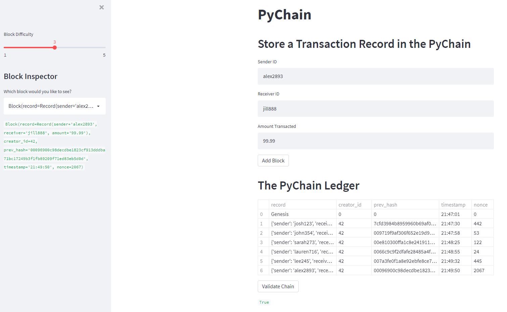

# Module 18 Challenge - PyChain Ledger

## Description

Building a blockchain-based ledger system, complete with a user-friendly web interface to allow users to conduct financial transactions and to verify the integrity of the data in the ledger.  

The sections of this project are as follows: 

* Create a Record Data Class 
* Modify the Existing Block Data Class to Store Record Data
* Add Relevant User Inputs to the Streamlit Interface
* Test the PyChain Ledger by Storing Records (This section is located in this README file to demonstrate the functionality of the tool.)

---

## Test the PyChain Ledger by Storing Records

The following screenshots demonstrates the application working with multiple stored blocks in the ledger, as well as verifying the integrity of the ledger.  Utilizing the Block Inspector drop-down menu on the left of the application, the user can view specific block contents.  



---

## Technologies

This project leverages Python 3.7.  The following packages are also used: 

* [pandas](https://github.com/pandas-dev/pandas) - Data analysis toolkit for Python.

* [Streamlit](https://github.com/streamlit) - Tool to build user friendly, web based data apps in Python

---

## Installation Guide

Before running the application, install Python modules Pandas, hvPlot, SQLAlchemy and Voila:

```python

  conda install pandas

  pip install streamlit

```
---

## Contributors

Joshua Creveling

Email: josh.creveling22@gmail.com

GitHub: https://github.com/joshuacreveling

LinkedIn: https://www.linkedin.com/in/joshua-creveling/

*Starter template provided by Trilogy Education Services*

---

## License

MIT
